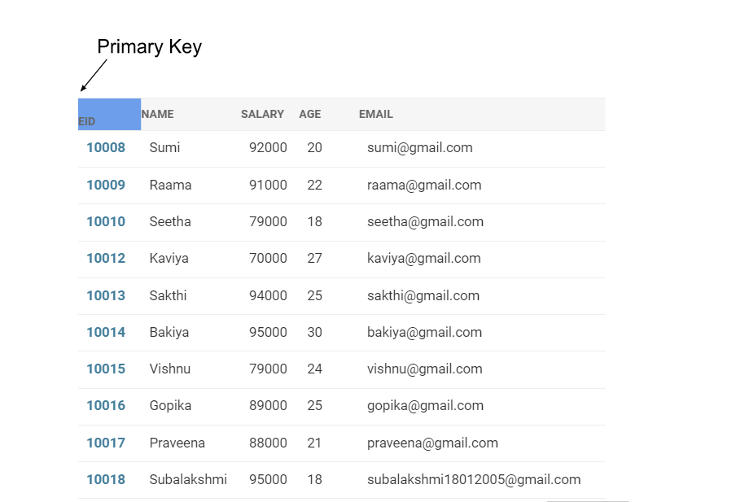
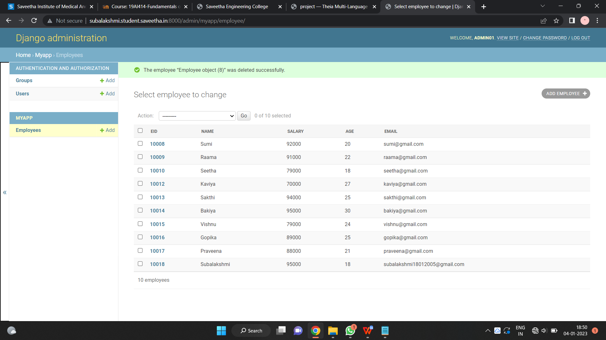

# Django ORM Web Application

## AIM
To develop a Django application to store and retrieve data from a database using Object Relational Mapping(ORM).

## Entity Relationship Diagram



## DESIGN STEPS

### STEP 1:
Clone the repository in github

### STEP 2:
Open models.py and admin.py and type the following 

### STEP 3:
Create a migrate file that contains code for the database schema of a model in myapp

### STEP 4:
Create users in the employee link under myapp


## PROGRAM
```
admin.py
from django.contrib import admin
from .models import Employee,EmployeeAdmin
admin.site.register(Employee,EmployeeAdmin)

models.py
from django.db import models
from django.contrib import admin
class Employee(models.Model):
    eid=models.CharField(max_length=20,help_text="Employee ID")
    name=models.CharField(max_length=100)
    salary=models.IntegerField()
    age=models.IntegerField()
    email=models.EmailField()

class EmployeeAdmin(admin.ModelAdmin):
    list_display=('eid','name','salary','age','email')
```

## OUTPUT




## RESULT
Program created successfully